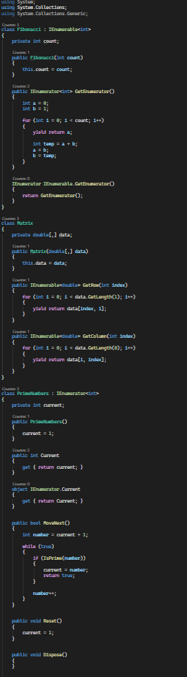
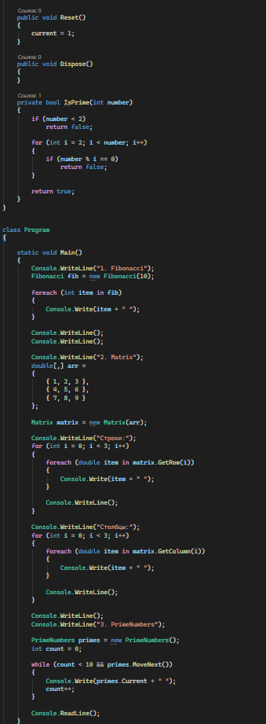
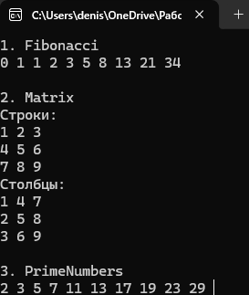

# C# KT15

1. Напишите класс Fibonacci, который реализует интерфейс IEnumerable<int> и возвращает последовательность чисел Фибоначчи. Для этого используйте ключевое слово yield для возврата очередного элемента последовательности в методе GetEnumerator(). Затем напишите пример использования этого класса в цикле foreach для вывода на консоль первых десяти чисел Фибоначчи.

2. Напишите класс Matrix, который представляет двумерный массив чисел типа double. Затем напишите метод IEnumerable<double> GetRow(int index), который возвращает перечислитель по элементам заданной строки матрицы. Аналогично напишите метод IEnumerable<double> GetColumn(int index), который возвращает перечислитель по элементам заданного столбца матрицы. Затем напишите пример использования этих методов в циклах foreach для вывода на консоль элементов матрицы по строкам и по столбцам.

3. Напишите класс PrimeNumbers, который реализует интерфейс IEnumerator<int> и возвращает последовательность простых чисел. Для этого используйте поле типа int для хранения текущего простого числа и переопределите методы MoveNext(), Reset() и Current для перемещения к следующему простому числу, сброса к начальному состоянию и возврата текущего простого числа соответственно. Затем напишите пример использования этого класса в цикле while для вывода на консоль первых десяти простых чисел.

### Код

### Результат

